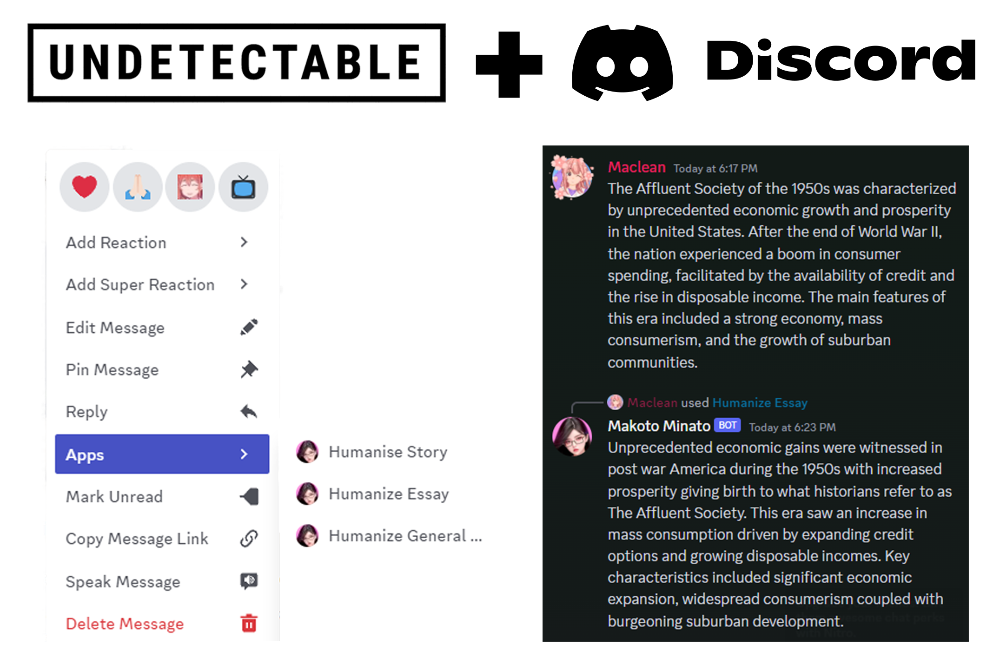

# Undetectable AI Discord Bot
A Discord bot that uses context menus to rewrite messages with the [Undetectable AI](https://undetectable.ai?fpr=yws1m) API.


## Setup

1. Clone the repository:

```bash
git clone https://github.com/yourusername/UndetectableAIDiscord.git
```

2. Install the required dependencies:

```bash
cd UndetectableAIDiscord
npm install
```

3. Configure the `.env` file:

Copy the `.env` file from the repository and update the following variables:

- `BOT_TOKEN`: Your Discord bot token
- `CLIENT_ID`: Your Discord bot's client ID

Guide to obtain these here: https://www.writebots.com/discord-bot-token/
- `GUILD_ID`: Your server's guild ID

Turn on Discord developer mode, right click the server you added it to and "Copy Server ID"
- `UNDETECTABLE_API_KEY`: Your Undetectable AI API key

Create an [Undectable.AI](https://undetectable.ai?fpr=yws1m) Account and paste your API key here.

1. Run the bot:

```bash
node index.js
```

The bot should now be running, and you can use the context menu commands to rewrite messages with the Undetectable AI API.

## Usage

To use the bot, simply right-click on a message in your Discord server and choose one of the following context menu options:

- Humanize General Writing: Rewrites the message using high school readability and general writing purpose.
- Humanize Essay: Rewrites the message using university readability and essay purpose.
- Humanise Story: Rewrites the message using university readability and story purpose.

The bot will process the selected message using the Undetectable AI API and send the rewritten text as a reply.

Remember that you need to have sufficient word balance in your Undetectable AI account for the bot to process the text. If you encounter any issues or errors, check the bot's console output for more information.

#### Other

Purchases made through some links may provide some compensation to Maclean Dunkin.